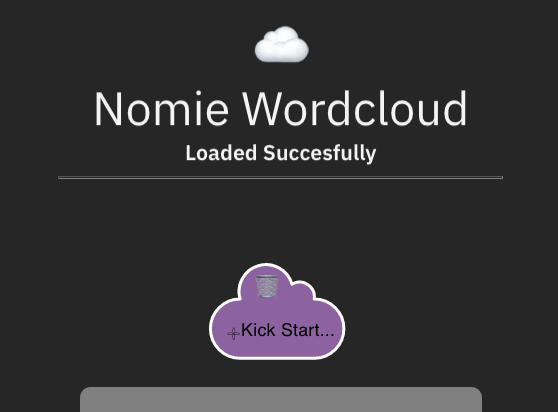
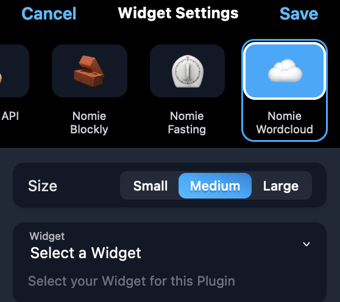

# ☁️ Nomie WordCloud Plugin

The ☁️Nomie WordCloud Plugin is a plugin for Nomie6-oss.

## About the ☁️Nomie WordCloud Plugin

The Nomie WordCloud plugin introduces a new widget for the Nomie Dashboard. The plugin let's you create wordcloud patterns which you can show as widgets on the Nomie Dashboard.

The Plugin comes with 3 predefined patterns and will let you create as many custom patterns as you would like

## Installing the Plugin

The url of the plugin is:

[https://dailynomie.github.io/nomie-plugin-widget-wordcloud/](https://dailynomie.github.io/nomie-plugin-widget-wordcloud/)

The ☁️Nomie WordCloud Plugin can be installed in Nomie via the following steps:

* Go to the More Tab
* Select Plugins
* Click the + or Add Custom Plugin
* Provide the url for the plugin
* Tap Install Plugin

## How to use the ☁️Nomie WordCloud Plugin

After installing the Plugin, please open the plugin to initialise the plugin and configure your first wordcloud.

Due to the setup of the Nomie plugin engine, the plugin should be openened first in order to be able to add Worscloud widgets to your dashboard.

When the plugin is opened you will be presented with an empty dashboard:

Please click on the button to add your first WordCloud. You will be requested to choose a template. Currently only the Kick Starter template is available:

After clicking the Kick Starter template you will get the following screen with the Kick Starter WordCloud added:

Now, click on the purple cloud to configure this wordcloud:

You can now change the configuration:

### Name

This defines the name of your WordCloud configuration, please provide a name which you will recognise when you will add the widget to your dashboard later

### Description

Provide a short description of the content of the wordcloud

### Keywords

This is an important setting, Please fill in all the keywords which you would like to count its appearance in your Nomie logs. Example: if you would like to create a wordcloud widget with ords from all the sports you have been doing over the last 90 days, please fill these sports in as keywords => "soccer,tennis,running,swimming"

The keywords should be comma seperated.

### Color & Emoji

These fields let you choose the color of the cloud on your plugin dashboard and an emoji representing this wordcloud configuration

### Time Range

This field let's you choose the timerange to be usd to count the keywords in the Nomie logs. Example: you can choose to count the keywords for the last 30 days, or 90 days.

The weight of the keyword in the final wordcloud will be derived from the amount of times this keyword has been counted.

### Save

After configuring your settings, please click on the save button at the bottom of the screen... and you are done.

## Adding a WordCloud widget to the Dashboard

Now that you have configured your first wordcloud, you can add the wordcloud to the Nomie Dashboard as a Widget.

Please be aware that there are already 3 predefined wordclouds included in the Plugin:

* Emotions: this wordcloud will cound all the words expressing an emotion in your Nomie Logs for the last 90 days and create a wordcloud from this.
* Virtues: same as above mentioned Emotions wordcloud, but now based on virtues
* Persons: this wordcloud will count the amount of times defined person trackables have been mentioned in your Nomie Logs for the last 90 days and creates a wordcloud from the data.

In order to add a Wordcloud Widget to your dashboard, please first go to your dashboard and choose 'Add Widget':

You will be directed to the following screen, please click on the WordCloud Widget:

Now, please click on the Select a Widget selection field. You will be presented with the predefined wordclouds and your own created wordcloud:

For this example I picked the 🥴 Emotions WordCloud. Now, please click on the 'save' option in the top right corner.

The WordCloud Widget is now added tou your Nomie Dasboard:

### Bonus feature for the persons wordcloud

When using the persons wordcloud, you can click on any name in the wordcloud and Nomie will open a new log editor with the name of the person you just clicked already pre-filled. This will enable you to quickly log an item for that person.

### Final words

I guess there is not much more to say about this Plugin. As always, have fun with this plugin!
